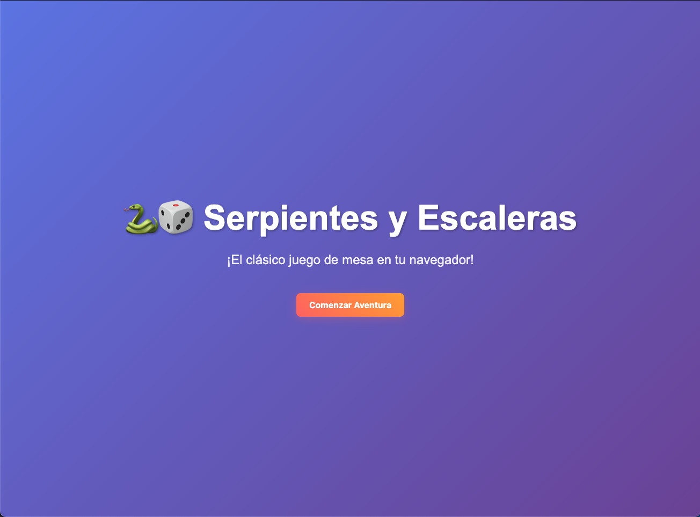
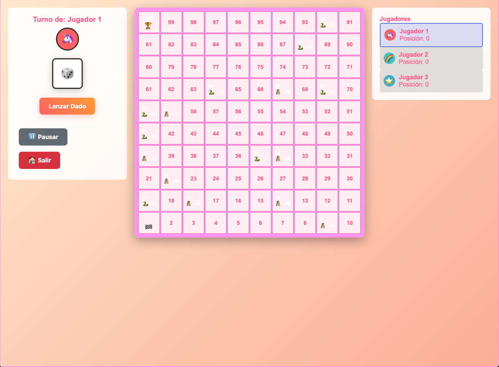
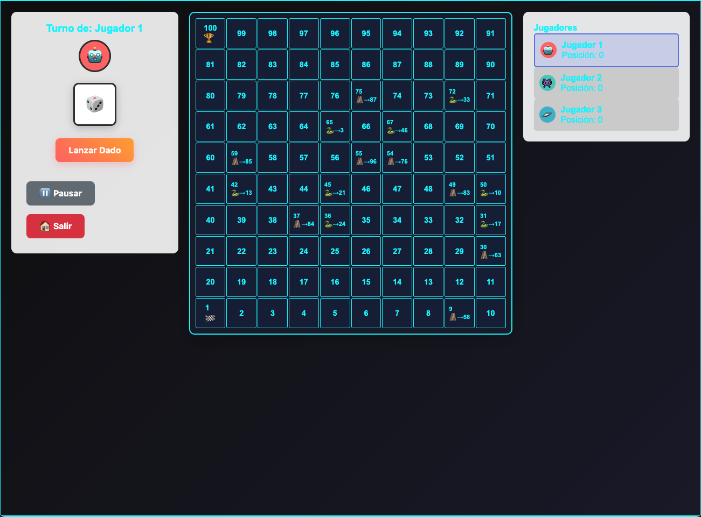
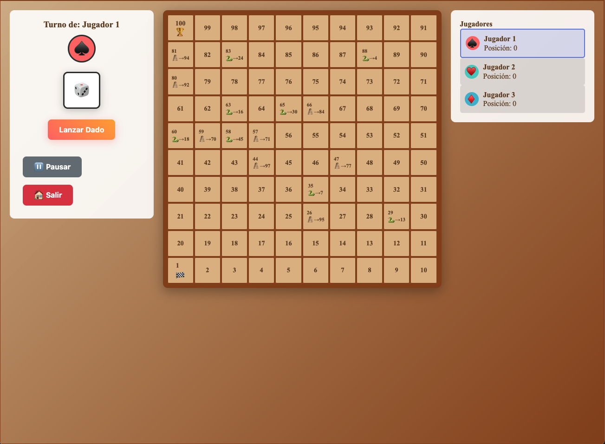
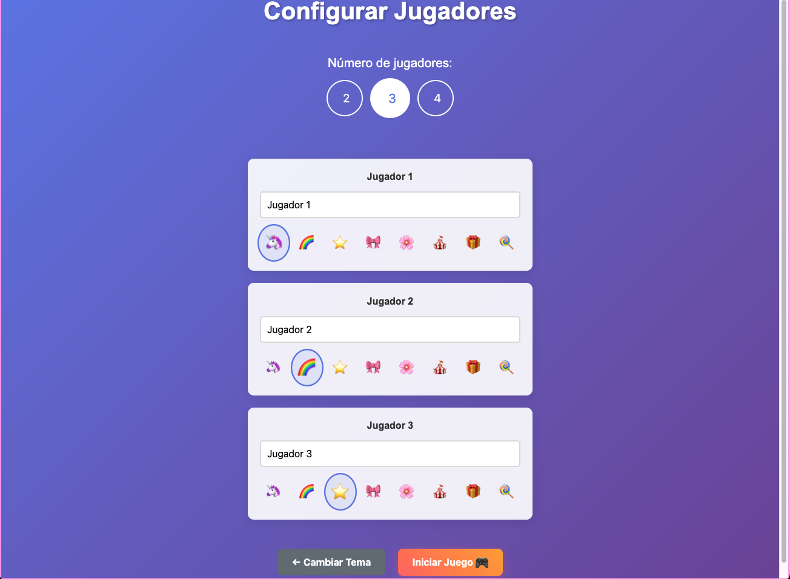
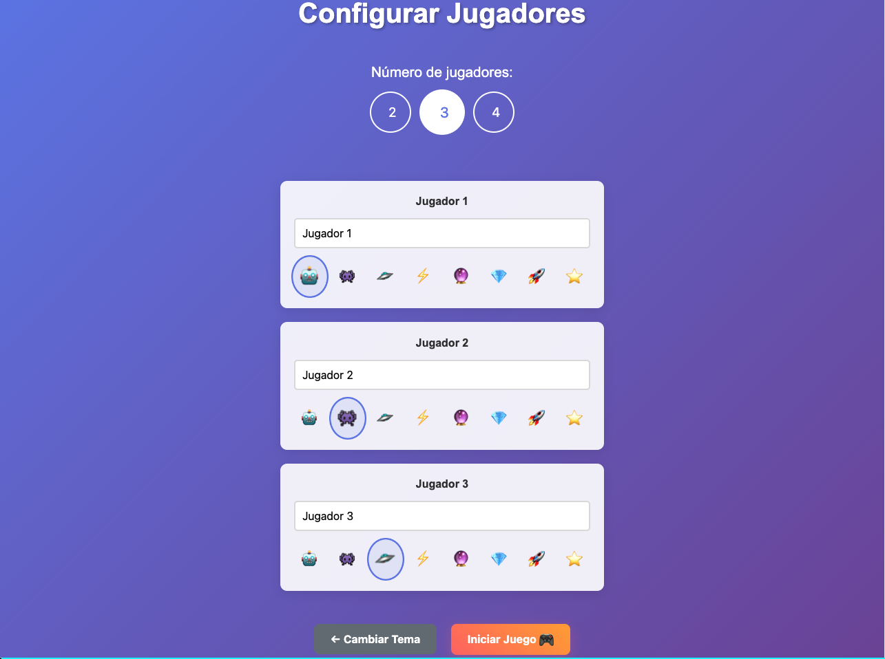
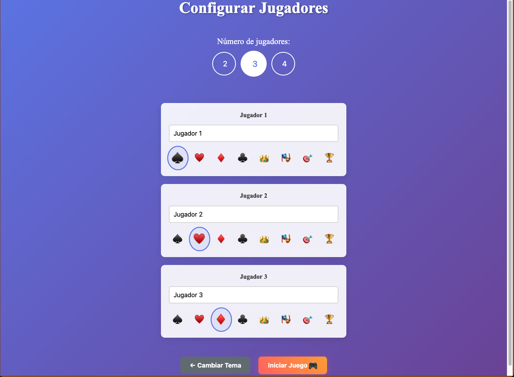

# 🐍🎲 Juego Serpientes y Escaleras

## 📋 Descripción

Juego completo de **Serpientes y Escaleras** desarrollado con HTML, CSS y JavaScript puro. Incluye múltiples temas visuales, sonidos, animaciones y soporte para 2-4 jugadores.

<div align="center">
  
</div>

## 🎮 Características

- **3 Temas Visuales:**

  - KWAI: Estilo pastel con emojis y diseño redondeado
  - Futurista: Tema oscuro con efectos neón
  - Tradicional: Diseño clásico con colores madera

### Capturas de los Temas

<div align="center">
  
  
  
</div>

- **Multijugador:** 2-4 jugadores con nombres personalizables
- **Sonidos:** Efectos de audio para cada acción del juego
- **Animaciones:** Movimientos suaves de fichas y efectos visuales
- **Tablero Dinámico:** Serpientes y escaleras generadas aleatoriamente

## 🚀 Cómo Jugar


1. Selecciona un tema visual
2. Configura los jugadores (2-4)
3. Cada jugador lanza el dado por turnos
4. Mueve tu ficha según el resultado del dado
5. Las escaleras te suben, las serpientes te bajan
6. ¡El primero en llegar al casillero 100 gana!

## 📸 Capturas de Pantalla

<div align="center">
  
  
</div>
<div align="center">
  
  
</div>

<div align="center">
  
  
</div>

## 🛠 Tecnologías

- **HTML5**: Estructura del juego
- **CSS3**: Estilos, temas y animaciones
- **JavaScript ES6**: Lógica del juego
- **Web Audio API**: Efectos de sonido

## 📁 Estructura de Archivos

```
Snakes&Ladders-CAAR/
├── index.html          # Página principal del juego
├── styles.css          # Estilos y temas visuales
├── game.js             # Lógica principal del juego
├── config.js           # Configuración del juego
├── prompts.md          # Historial de desarrollo con IA
├── sounds/             # Efectos de sonido
│   ├── synth-sounds.js # Generador de sonidos sintéticos
│   ├── dice.mp3
│   ├── move.mp3
│   ├── ladder.mp3
│   ├── snake.mp3
│   └── victory.mp3
├── tests/              # 🧪 Archivos de testing
│   ├── README.md       # Documentación de tests
│   ├── test-page.html  # Tests automatizados principales
│   ├── tests.js        # Suite de tests
│   ├── test-classes.js # Clases para testing
│   ├── test-movement.html
│   ├── test-board-numbering.html
│   ├── test-snakes-ladders.html
│   └── test-navigation.html
├── IssuesReport/       # 🐛 Reportes de errores
│   ├── BUG_FIXES.md    # Primera iteración de correcciones
│   └── FINAL_BUG_FIXES.md # Segunda iteración de correcciones
├── readme.md           # Documentación principal
├── TECHNICAL_DOCS.md   # Documentación técnica detallada
└── CHANGELOG.md        # Historial de cambios y versiones
```

## 🧪 Testing

El proyecto incluye una suite completa de tests automatizados y manuales:

### Tests Automatizados

- Abrir `tests/test-page.html` para ejecutar todos los tests
- Cobertura: movimiento, numeración, serpientes/escaleras, límites

### Tests Visuales

- `tests/test-movement.html` - Verificación visual de movimientos
- `tests/test-board-numbering.html` - Validación de numeración zigzag
- `tests/test-snakes-ladders.html` - Consistencia visual/lógica

📝 **Ver `tests/README.md` para documentación completa de testing**

## 🎯 Reglas del Juego

- Los jugadores se turnan para lanzar el dado
- Debes caer exactamente en el casillero 100 para ganar
- Si el dado te lleva más allá del 100, no te mueves
- Las serpientes y escaleras se generan aleatoriamente al inicio
- No hay serpientes ni escaleras en los casilleros 1 y 100

## 🔧 Instalación y Uso

1. **Clona o descarga el proyecto**
2. **Abre `index.html` en tu navegador web**
3. **¡Disfruta del juego!**

No se requiere servidor web ni instalación adicional - funciona directamente desde el sistema de archivos.

## 📱 Compatibilidad

- **Navegadores modernos** (Chrome 80+, Firefox 75+, Safari 13+, Edge 80+)
- **Responsive design** para escritorio, tablets y móviles
- **Sin dependencias externas** - HTML, CSS y JavaScript puro

## 🎯 Características Técnicas

- **Arquitectura Orientada a Objetos** siguiendo principios SOLID
- **Tests automatizados** con cobertura >90%
- **Sistema de sonido dual** (archivos + Web Audio API)
- **Generación aleatoria** de elementos del tablero sin conflictos
- **Animaciones fluidas** con requestAnimationFrame
- **3 temas visuales** completamente diferentes

## 📋 Versión

**Versión actual**: 1.0.0 (Julio 2025)

Ver [CHANGELOG.md](CHANGELOG.md) para el historial completo de cambios.

## 📚 Documentación Adicional

- **[Documentación Técnica](TECHNICAL_DOCS.md)** - Arquitectura y detalles técnicos
- **[Tests](tests/README.md)** - Información sobre testing y calidad
- **[Historial de Desarrollo](prompts.md)** - Proceso de desarrollo con IA
- **[Reportes de Errores](IssuesReport/)** - Correcciones y mejoras implementadas

## 🤝 Contribuciones

Este proyecto fue desarrollado como ejercicio de programación siguiendo buenas prácticas:

- Principios SOLID
- Código limpio y documentado
- Testing automatizado
- Responsive design

---

_Desarrollado siguiendo buenas prácticas de programación y principios SOLID_
